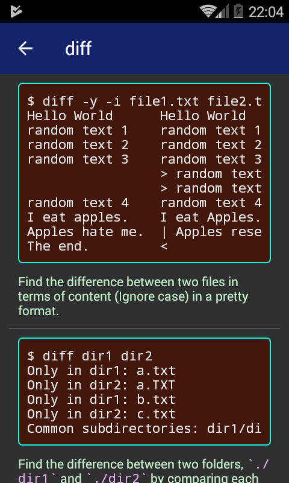

This document teaches you about the syntax of `man.json`.

# Example

Manpage of `diff` command:

```
{
    "name": "diff",
    "summary": "DIFFerence - find the difference between two files in terms of their content or between two directories in terms of each filename.",
    "premise": [
        {
            "paragraph": "Suppose in file1.txt",
            "isCodeSnippet": false
        },
        {
            "paragraph": "Hello World\nrandom text 1\nrandom text 2\nrandom text 3\nrandom text 4\nI eat apples.\nApples hate me.\nThe end.",
            "isCodeSnippet": true
        },
        {
            "paragraph": "in file2.txt",
            "isCodeSnippet": false
        },
        {
            "paragraph": "Hello World\nrandom text 1\nrandom text 2\nrandom text 3\nrandom text 5\nrandom text 45\nrandom text 4\nI eat Apples.\nApples resent me.",
            "isCodeSnippet": true
        },
        {
            "paragraph": "in dir1/",
            "isCodeSnippet": false
        },
        {
            "paragraph": "dir1\n├── a.txt\n├── b.txt\n├── dir11\n│   └── a.txt\n└── d.txt",
            "isCodeSnippet": true
        },
        {
            "paragraph": "in dir2/",
            "isCodeSnippet": false
        },
        {
            "paragraph": "dir2\n├── a.TXT\n├── c.txt\n├── dir11\n└── d.txt",
            "isCodeSnippet": true
        }
    ],
    "examples": [
        {
            "code": "$ diff -y file1.txt file2.txt\nHello World      Hello World\nrandom text 1    random text 1\nrandom text 2    random text 2\nrandom text 3    random text 3\n                 > random text 5\n                 > random text 45\nrandom text 4    random text 4\nI eat apples.    | I eat Apples.\nApples hate me.  | Apples resent me.\nThe end.         <",
            "description": "Find the difference between two files in terms of content in a pretty format. <font color='#FB6967'>&gt;</font> means the line is missing in file1.txt; <font color='#FB6967'>&lt;</font> means the line is missing in file2.txt; <font color='#FB6967'>|</font> means the line is similar between two files but different."
        },
        {
            "code": "$ diff -y -i file1.txt file2.txt\nHello World      Hello World\nrandom text 1    random text 1\nrandom text 2    random text 2\nrandom text 3    random text 3\n                 > random text 5\n                 > random text 45\nrandom text 4    random text 4\nI eat apples.    I eat Apples.\nApples hate me.  | Apples resent me.\nThe end.         <",
            "description": "Find the difference between two files in terms of content (Ignore case) in a pretty format."
        },
        {
            "code": "$ diff dir1 dir2\nOnly in dir1: a.txt\nOnly in dir2: a.TXT\nOnly in dir1: b.txt\nOnly in dir2: c.txt\nCommon subdirectories: dir1/dir11 and dir2/dir11",
            "description": "Find the difference between two folders, `./dir1` and `./dir2` by comparing each filename in folders. Note that it will not compare the difference in subdirectories of `./dir1` and `./dir2`: `./dir1/dir11` and `./dir2/dir11`."
        },
        {
            "code": "$ diff --ignore-file-name-case dir1 dir2\nOnly in dir1: b.txt\nOnly in dir2: c.txt\nCommon subdirectories: dir1/dir11 and dir2/dir11",
            "description": "Find the difference between two folders, `./dir1` and `./dir2` by comparing each filename in folders (ignoring filename case). Note that it will not compare the difference in subdirectories of `./dir1` and `./dir2`: `./dir1/dir11` and `./dir2/dir11`."
        },
        {
            "code": "$ diff -r dir1 dir2\nOnly in dir1: a.txt\nOnly in dir2: a.TXT\nOnly in dir1: b.txt\nOnly in dir2: c.txt\nOnly in dir1/dir11: a.txt",
            "description": "Find the difference between two folders Recursively, `./dir1` and `./dir2` by comparing each filename in folders."
        }
    ],
    "tips": [
        "Using `vimdiff file1.txt file2.txt` is more convenient than `diff` since the former supports syntax highlighting. You can also edit the file on the fly."
    ],
    "relatedCommands": [

    ]
}
```

equivalent to





# Mechanism

The `man.json` will be mapped to `Manpages` class.

# Syntax

`name`: String

Command name.

`summary`: String

A short summary telling what the command can do. HTML tags are not supported.

`premise`: Object[]

```
{
    "paragraph": "<summary-paragraph>",
    "isCodeSnippet": true | false
}
```

Give readers a scenario before teaching them any command so that the command 
examples will be more understandable.

`premise[?].paragraph`: String

Paragraph. It can be a regular text or code. HTML tags is not supported
in this section.

`premise[?].isCodeSnippet`: boolean

If set as `true`, the summary will be treated as code and wrapped with a code block
using `monospace` font when the summary is shown. If `false`, the summary will
be rendered as normal, regular text.

`examples`: Object[]

```
{
    "code": "<example-code>",
    "description": "<description-of-what-the-code-does>"
}
```

Code examples showing what the command can do.

`examples[?].code`: String

Code example. It will be wrapped with a code block using `monospace` font
when it is rendered. HTML tags are not supported.

`examples[?].description`: String

Describing what the example is doing. HTML tags are supported. Text quoted
with backticks `` `<text>` `` will be rendered with `monospace` font.

`tips`: String[]

Showing additional information about the command. HTML tags are supported.
Text quoted with backticks `` `<text>` `` will be rendered with `monospace` font.

`relatedCommands`: String[]

Suggesting readers about the commands that serve the similar purpose as
the command that they are currently viewing. Each command will be rendered 
as a clickable hyperlink linking to other command.
